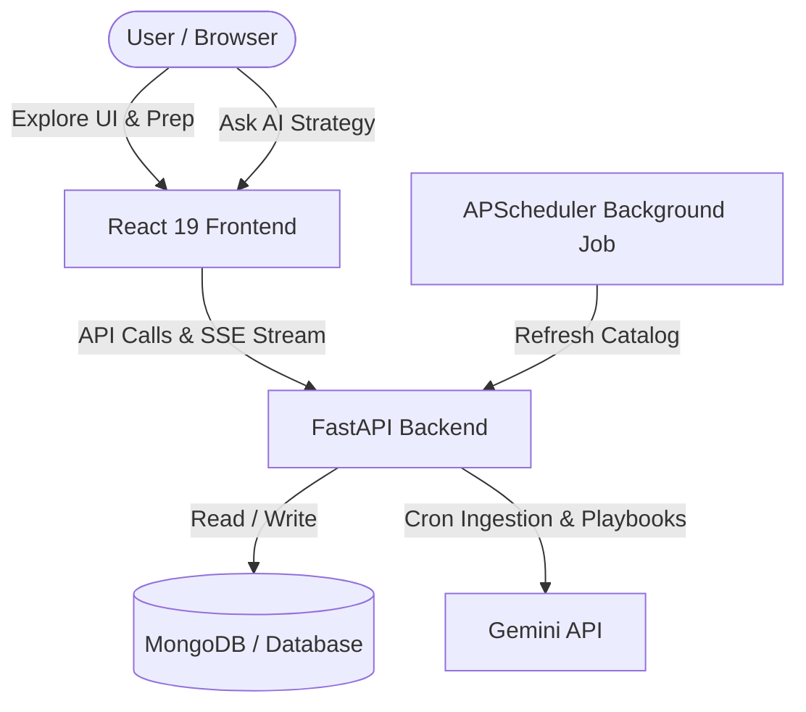

# 🔭 Scout — HackTrack

<div align="center">
  

  <p align="center">
    <strong>A live, self-updating catalog of hackathons, conferences, and technical summits.</strong>
  </p>

  <p align="center">
    
    
    
    
    
  </p>
</div>

---

## 💡 Overview

**Scout** (codenamed **HackTrack**) is an advanced, production-grade intelligence platform designed for students and working professionals. It curates, tracks, and delivers preparation strategies for upcoming hiring hackathons, conferences, workshops, and meetups from top tech companies (such as Myntra, Meesho, etc.). 

The platform features a **live self-updating discovery engine** that monitors global opportunities (online, offline, hybrid, Indian, and international) and generates personalized, AI-powered interview/hackathon preparation playbooks on the fly.

---

## ✨ Features

- 🔄 **Live Self-Updating Catalog**: Periodic background ingestion jobs utilizing the **Gemini 1.5 Flash API** to discover new events globally.
- 🎯 **AI Prep Playbooks**: Custom-generated guides for every event detailing typical rounds, technical requirements, prep checklists, and curated resources.
- 🔎 **Deep Filter & Search**: Custom filter options (mode, region, status, target audience, hosting company) and text-search.
- 💬 **Streaming AI Assistant**: A real-time, SSE-based chatbot using Gemini to guide users on hackathon strategy, resume checks, and prep advice.
- 🔖 **Bookmark & Reminders**: Save opportunities locally (anonymous bookmarking) and configure 24h email notifications.
- 📅 **Calendar Sync**: Export ICS calendars directly for selected hackathons.
- 📚 **Resource Hub**: A curated repository of preparation assets (DSA, system design, mock platforms, startup hackathons).

---

## 🏛️ System Architecture



---

## 📂 Project Structure

```bash
Scout/
├── backend/                  # FastAPI Backend Server
│   ├── tests/                # Pytest suite (Hacktrack & OpportunityOS)
│   ├── .venv/                # Python Virtual Environment
│   ├── auth.py               # Authentication logic
│   ├── server.py             # Main router and endpoints
│   ├── scheduler.py          # Background cron jobs (APScheduler)
│   ├── storage.py            # Upload storage handling
│   ├── skills.py             # Resume skill parsing
│   └── requirements.txt      # Python dependencies
│
├── frontend/                 # React 19 Client App
│   ├── src/
│   │   ├── components/       # Layout, AIAssistant, HackathonCard, etc.
│   │   ├── pages/            # Home, Hackathons, Detail, Resources
│   │   ├── lib/              # API and authentication services
│   │   └── App.js            # Router and base structure
│   ├── public/               # Static assets & HTML index
│   ├── craco.config.js       # React config overrides
│   ├── tailwind.config.js    # Tailwind layout guidelines
│   └── package.json          # Node dependencies
│
├── memory/                   # Product logs & PRD
└── test_reports/             # Testing logs & Pytest outputs
```

---

## 🚀 Getting Started

### 1. Prerequisites
- **Python**: `>=3.9`
- **Node.js**: `>=18`
- **MongoDB**: Active connection instance (or configured connection URI)
- **Gemini API Key**: Obtain one from Google AI Studio.

---

### 2. Backend Setup
1. Navigate to the backend directory:
   ```bash
   cd backend
   ```
2. Activate your virtual environment and install dependencies:
   ```bash
   source .venv/bin/activate
   pip install -r requirements.txt
   ```
3. Set your environment variables:
   ```bash
   export MONGO_URL="mongodb://localhost:27017/scout"
   export GEMINI_API_KEY="your-gemini-api-key"
   ```
4. Start the server (uvicorn):
   ```bash
   uvicorn server:app --reload --port 8000
   ```

---

### 3. Frontend Setup
1. Navigate to the frontend directory:
   ```bash
   cd ../frontend
   ```
2. Install React dependencies:
   ```bash
   npm install --legacy-peer-deps
   ```
3. Configure target backend URL:
   ```bash
   export REACT_APP_BACKEND_URL="http://localhost:8000"
   ```
4. Start the local development server:
   ```bash
   npm start
   ```

---

## 🎨 UI Guidelines

The design follows **Swiss & High-Contrast** aesthetics with a clean light theme. For details on layouts, colors, and typography tokens, check out [design_guidelines.json](file:///Users/ruthvikgoud/Music/Scout/design_guidelines.json).

---

<div align="center">
  <sub>Built with ❤️ by Antigravity and the Scout Developer Team.</sub>
</div>
